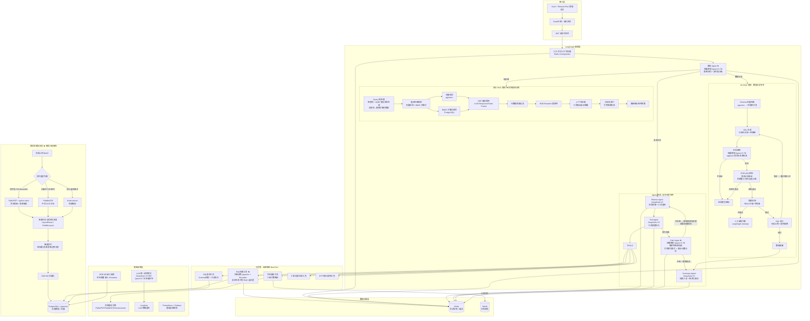

# 企业级多 Agent + RAG 知识库平台 — 架构设计文档

> **版本**: v3.0 | **日期**: 2025-06-25 | **状态**: 已确认（v2 修正架构逻辑 + v3 对齐业界最佳实践）

---

## 一、项目定位

### 1.1 一句话定位

企业级智能数据分析与知识管理平台，基于 LangGraph 状态机编排，实现 RAG 知识检索 + NL2SQL 数据分析双管线，支持多步骤复杂任务自主拆解执行。

### 1.2 核心场景

| 优先级 | 场景 | 展示能力 |
|--------|------|---------|
| **P0（落地开发）** | S1: "近三月服务器故障分析 + 优化方案 + 生成工单" | Agent 多步骤编排、Critic 确定性溯源、RAG+NL2SQL 工具混合调用 |
| **P0（落地开发）** | S2: "华南区 Q2 销售额与去年同期对比" | NL2SQL 全链路、合规审核、数据脱敏、权限校验 |
| **P1（口头补充）** | S3: "合同 PDF 风险条款提取" | 多模态三级解析、版面分析 |
| **P1（口头补充）** | S4: "部门季度安全报告生成" | 多工具联动、报告自动生成 |

### 1.3 核心痛点覆盖

| 痛点 | 本方案如何解决 |
|------|--------------|
| 单轮 RAG 无法拆解复杂问题 | LangGraph 显式状态机：Planner 拆解 → Tool 执行 → Critic 确定性溯源 → 不合格回退重规划 |
| 文档类型杂乱，多模态解析差 | **三级离线解析架构**：PyMuPDF（文字型 PDF）→ PaddleOCR（扫描件）→ Unstructured（日志/图片等非标文档）。完全离线私有化部署 |
| 无工具调用能力 | 5 个核心工具（RAG检索/SQL查询/文档解析/工单生成/HTTP调用），全部继承 BaseTool |
| 无记忆，多轮对话丢失 | Redis Checkpointer 状态持久化 + 向量记忆检索压缩上下文 |
| 无权限隔离 | RBAC 三级权限（用户→角色→表/字段/行级）+ 合规审核 Agent 双重校验 |

---

## 二、技术栈

| 层级 | 选型 | 说明 |
|------|------|------|
| **编排框架** | LangGraph | 显式状态机，条件边 + interrupt 中断机制 |
| **后端框架** | FastAPI | Python AI 生态全栈，SSE 流式响应 |
| **数据库** | PostgreSQL + pgvector | 业务数据 + 向量检索合一，省掉独立向量库 |
| **缓存/会话** | Redis | LangGraph Checkpointer 持久化 + 热点缓存 |
| **对象存储** | MinIO | 文档原文存储，兼容 S3 协议，本地可跑 |
| **主力 LLM** | DeepSeek-V3 | 复杂任务规划、工具调度、总结生成 |
| **轻量 LLM** | Qwen2.5-7B（本地） | 路由分类、简单 SQL 校验、Critic 规则检查（低延迟 + 零成本） |
| **嵌入模型** | BGE-M3（本地部署） | 文本嵌入 + Reranker 双模式，中文最优 |
| **文档解析 - 文字型** | PyMuPDF (fitz) | 提取文字 + 表格 + 目录结构，轻量高效 |
| **文档解析 - 扫描件** | PaddleOCR | 中文 OCR 识别率最高，离线 GPU 部署 |
| **文档解析 - 非标文档** | Unstructured | 兜底处理日志/图片/混杂格式 |
| **版面分析** | LayoutParser / PaddleLayout | OCR 后还原标题→段落→表格→图片的层级树状结构 |
| **检索融合算法** | RRF (Reciprocal Rank Fusion) | 向量召回 + BM25 关键词召回结果统一排名，k=60 |
| **查询增强** | HyDE 自适应触发 | 查询长度 < 20 字 → 生成假设文档再检索；长查询直接检索（用户已描述清楚，HyDE 收益低） |
| **工具输出管理** | 后处理压缩 + Redis 暂存 | 工具返回原始数据存 Redis，只将压缩摘要送入 LLM 上下文 |
| **前端** | Vue3 + Element Plus | 企业管理后台标配 |
| **LLM 可观测** | Langfuse | Agent/RAG 链路追踪 |
| **基础设施监控** | Prometheus + Grafana | 服务器/数据库容器监控 |
| **依赖管理** | Poetry | Python 依赖锁定 |
| **SQL 解析** | sqlparse | 语法白名单校验 |

---

## 三、架构全景图（v2.0 修正版）

**关键修正**：
- **独立 RAG 管线只处理纯问答**（用户问 → 检索 → 回答），直接输出最终答案，不经过 Agent 管线
- **复杂任务中的 RAG 检索是工具调用**（T1 RAGRetrievalTool），走 Planner → Tool Agent → 工具执行路径，**不走独立 RAG 管线**
- 两条路径物理隔离，互不交叉



**关键路径说明**：

| 用户意图 | 走哪条路径 | RAG 检索怎么发生 |
|---------|-----------|----------------|
| **纯问答**："服务器故障常见原因有哪些？" | 路由 → **独立 RAG 管线** → 直接输出 | RAG 管线独立完成检索+回答 |
| **数据分析**："华南区 Q2 销售额" | 路由 → **NL2SQL 管线** → Summary | 不涉及 RAG（只查数据库） |
| **复杂任务**："近三月故障分析 + 优化方案 + 生成工单" | 路由 → Planner → **Tool Agent 调用 T1 RAG检索工具** → Critic → Summary | RAG 作为**工具**被调用，不走独立管线 |

---

## 四、各层组件详细设计

### 4.1 接入层

| 组件 | 职责 | 核心文件 |
|------|------|---------|
| FastAPI 网关 | 统一路由、请求/响应拦截、异常处理 | `src/api/app.py` |
| JWT 鉴权中间件 | 用户身份验证、token 刷新 | `src/api/middleware.py` |
| 会话路由 | 创建/查询/删除会话 | `src/api/routes/sessions.py` |
| 消息路由 | SSE 流式对话、历史消息查询 | `src/api/routes/chat.py` |
| 管理路由 | 用户/角色/权限 CRUD、审计日志查询 | `src/api/routes/admin.py` |
| 文档路由 | 文档上传、解析触发、状态查询 | `src/api/routes/documents.py` |
| Vue3 管理后台 | 对话页 + 管理后台（最简可用版） | `web/` |

### 4.2 编排层（LangGraph — 核心）

**全局 State 定义**：

```python
class AgentState(TypedDict):
    # 用户身份
    user_id: str
    user_dept: str
    user_role: str

    # 对话上下文
    query: str
    messages: Annotated[list, add_messages]

    # 路由结果
    intent: str                    # "simple_qa" | "data_analysis" | "complex_task"
    query_complexity: str          # "low" | "medium" | "high"

    # Planner 拆解
    task_plan: list[dict]          # [{step_id, description, tool, depends_on}]

    # NL2SQL 链路
    relevant_schemas: list[dict]
    generated_sql: str
    sql_retry_count: int
    execution_result: list[dict]
    execution_error: str | None
    sql_safe: bool
    permission_pass: bool

    # 安全审核
    requires_human_review: bool
    human_approval: bool | None

    # Critic 确定性溯源 ★
    critic_result: dict            # {"quality_score": 0.85, "passed": True, "failed_checks": [...], "missing": "...", "superfluous": "...", "source_evidence": [...], "recommendation": "..."}
    replan_count: int              # Critic→Planner 回退次数（硬上限 3）
    prev_score: float              # 上一轮 quality_score（停滞检测用）

    # 独立 RAG 管线字段（仅 simple_qa 使用）
    retrieved_docs: list[dict]
    hallucination_check_pass: bool

    # 最终输出
    final_answer: str
    masked_result: list[dict]

    # 审计
    audit_log: dict
```

**节点职责**：

| 节点 | 使用模型 | 职责 | 输出 |
|------|---------|------|------|
| `router_node` | **Qwen2.5-7B**（轻量） | 意图识别 + 复杂度分级 | `intent`, `query_complexity` |
| `planner_node` | **DeepSeek-V3**（主力） | 复杂任务拆解为有序步骤，选择工具 | `task_plan` |
| `tool_node` | **DeepSeek-V3**（主力） | 按 plan 顺序调度工具执行，收集结果 | 写入 `messages` |
| `critic_node` | **Qwen2.5-7B**（轻量） | 确定性溯源校验：引用原文索引 + 表名/行数比对 + 工具调用链核查 | `critic_result` |
| `summary_node` | **DeepSeek-V3**（主力） | 汇总所有结果，格式化输出 | `final_answer` |
| `rag_pipeline_node` | **DeepSeek-V3** | 混合检索全流程 → **直接输出答案**，不进入 Agent 管线 | `final_answer` |
| `nl2sql_pipeline_node` | **DeepSeek-V3** | Schema 检索 → SQL 生成 → 合规审核 → 执行 | `generated_sql`, `execution_result` |
| `compliance_node` | **Qwen2.5-7B**（轻量） | SQL 语法白名单校验 + 权限校验 | `sql_safe`, `permission_pass` |
| `human_review_node` | — | LangGraph interrupt 中断，等待人工审批 | `human_approval` |

**条件边定义**（全部显式定义，禁止 LLM 自由路由）：

```python
# ========== 路由分发 ★ 三条路径互不交叉 ==========
router → rag_pipeline       if intent == "simple_qa"       # → 独立 RAG 管线，直接输出
router → nl2sql_pipeline    if intent == "data_analysis"    # → NL2SQL 管线
router → planner            if intent == "complex_task"     # → Agent 管线（工具中含 RAG）

# ========== RAG 管线（独立闭环，不进入 Agent 管线）==========
rag_pipeline → END           # 纯问答直接输出，不经过 Summary

# ========== Critic 确定性溯源自循环 ★ ==========
# 条件边在 critic_node 内部直接判断 + 自增 replan_count
# 不额外定义 increment_replan 节点，避免图结构膨胀
def should_continue_after_critic(state: AgentState) -> str:
    state["prev_score"] = state["critic_result"]["quality_score"]
    if state["critic_result"]["quality_score"] >= 0.8:
        return "summary"
    if state.get("replan_count", 0) >= 3:          # ★ 硬上限
        return "summary"
    if state["critic_result"]["quality_score"] <= state.get("prev_score", 0) and state.get("replan_count", 0) > 0:
        return "summary"                            # ★ 停滞检测
    state["replan_count"] = state.get("replan_count", 0) + 1  # ★ 递增
    return "planner"                                # → 携带 missing/superfluous 回退

# ========== NL2SQL 合规分支 ==========
compliance → human_review   if not permission_pass
compliance → sql_execution  if sql_safe and permission_pass
compliance → END            if not sql_safe

# ========== SQL 重试 ==========
sql_execution → nl2sql_pipeline  if error and retry_count < 2
sql_execution → summary           if success
sql_execution → END               if error and retry_count >= 2
```

### 4.3 Agent 层 + 模型分级路由

**核心原则**：不是每个节点都需要 DeepSeek-V3。轻量节点用本地 Qwen2.5-7B，复杂节点才用 DeepSeek-V3。一次复杂任务节省 60-70% Token 消耗。

| Agent | 使用模型 | 原因 | Prompt 策略 |
|-------|---------|------|------------|
| **路由 Agent** | Qwen2.5-7B（轻量） | 只需输出枚举标签，无需推理 | 少样本分类，输出枚举值 |
| **Planner Agent** | DeepSeek-V3（主力） | 需要复杂推理和多步骤规划 | 结构化输出 JSON Plan，每步必须指定 tool + depends_on |
| **Tool Agent** | DeepSeek-V3（主力） | 需要理解工具结果并决策下一步 | ReAct 模式，记录 tool_name + input + output |
| **Critic Agent** | Qwen2.5-7B（轻量） | 只做规则化溯源比对，不自由推理 | 强制按溯源清单逐项核查 |
| **Summary Agent** | DeepSeek-V3（主力） | 需要高质量自然语言生成 + 图表 JSON | 按场景模板格式化，ECharts JSON 输出 |
| **合规审核（NL2SQL）** | Qwen2.5-7B（轻量） | 只做 sqlparse 白名单规则匹配 | 不调用 LLM，纯规则引擎 |

**模型降级策略**：
```
DeepSeek-V3 超时/不可用 → 降级到 Qwen2.5-7B（功能降级但系统不崩溃）
Qwen2.5-7B 不可用 → 所有节点切换到 DeepSeek-V3（自动回退）
```

### 4.4 Critic 确定性溯源机制 ★

**核心原则**：大模型无法验证自己不知道的事实。Critic 不做自由心证，只做**强制溯源比对 + 结构化反馈**。

**与业界 Reflexion 模式对齐**：Critic 输出不仅是 pass/fail，而是**质量评分(0-1) + 结构化批评(missing/superfluous)**，Planner 根据具体批评精准修正，而非盲目重新规划。

```python
# Critic 的结构化输出 Schema（对齐业界 Reflection Agent 标准）
class CriticVerdict(BaseModel):
    quality_score: float          # 0.0~1.0，≥0.8 为通过
    passed: bool                  # 快捷判断
    failed_checks: list[str]      # 失败的检查项名称
    missing: str                  # ★ "缺少了什么"——Planner 据此补充
    superfluous: str              # ★ "什么是多余的"——Planner 据此删减
    source_evidence: list[dict]   # 溯源证据链
    recommendation: str           # 给 Planner 的具体修正建议


# Critic 的确定性检查清单（不依赖 LLM 自由判断）
CRITIC_CHECKLIST = [
    {
        "name": "RAG 溯源",
        "check": "每个事实性陈述是否附带 chunk_id + 原文档页码",
        "rule": "若陈述无引用 → fail; 若引用页码不存在 → fail; 计入 missing"
    },
    {
        "name": "SQL 溯源",
        "check": "SQL 结果是否携带 table_name + row_count",
        "rule": "若结果无表名 → fail; 若 row_count 异常（0 或 > 阈值）→ 警告; 计入 missing"
    },
    {
        "name": "工具调用链完整性",
        "check": "是否所有 plan_steps 都有对应的 tool 调用记录",
        "rule": "若某 step 无执行记录 → fail; 计入 missing"
    },
    {
        "name": "数值一致性",
        "check": "Summary 中的数值是否与原始 tool 返回数据一致",
        "rule": "逐条比对 Summary 中的数据点 ↔ tool 返回结果的原始值（从 Redis 获取）"
    },
    {
        "name": "权限合规",
        "check": "所有返回文档的 doc_tags 是否在用户允许范围内",
        "rule": "若出现越权文档 → fail + 触发审计告警"
    },
    {
        "name": "反幻觉",
        "check": "是否存在无溯源依据的编造内容",
        "rule": "逐句比对陈述 ↔ source_evidence，无引用的陈述计入 superfluous"
    }
]

# Critic 节点函数签名
def critic_node(state: AgentState) -> dict:
    """确定性溯源 + 结构化反馈。
    
    关键设计决策：这不是让 LLM "感觉对不对"，
    而是让规则引擎逐项比对 state 中的 tool 输出与 summary 草案。
    Qwen2.5-7B 仅用于格式化输出（将规则引擎结果转为自然语言反馈）。
    """
    verdict = run_deterministic_checks(state)  # 规则引擎
    # Qwen 仅做格式化
    return {"critic_result": verdict.model_dump()}


# 条件边：根据评分决定流转
def should_continue_after_critic(state: AgentState) -> str:
    verdict = state["critic_result"]
    if verdict["quality_score"] >= 0.8:
        return "summary"       # → 汇总输出
    if state.get("replan_count", 0) >= 3:
        return "summary"       # ★ 硬上限保护（对齐业界 max_iterations=3）
    # 检查是否停滞（分数不再提升）
    if verdict["quality_score"] <= state.get("prev_score", 0):
        return "summary"       # ★ 停滞检测（对齐业界 staleness detection）
    return "replan"            # → 携带 missing/superfluous 回到 Planner
```

**面试讲述要点**：
> "Critic 不是问 LLM '你觉得对不对'——那是幻觉放大器。我们参考了业界 Reflexion 模式，Critic 输出质量评分 + 结构化批评（缺少什么/多余什么），Planner 拿到这些精准反馈再做修正，而不是盲目重试。底层检查逻辑全是规则引擎，只有格式化用 Qwen2.5-7B，所以这个环节零推理成本。"

### 4.5 工具层（5 个工具）

全部继承 `langchain_core.tools.BaseTool`，内置权限校验埋点 + 审计日志。

| 工具 | 核心逻辑 | 安全约束 |
|------|---------|---------|
| **RAGRetrievalTool** ★ | 自适应 HyDE（短查询触发）→ pgvector 向量 + PostgreSQL tsvector BM25 关键词 → RRF 融合(k=60) → BGE-Reranker → 上下文压缩。**复杂任务中的 RAG 走这里** | 元数据权限过滤 + 附带回传 chunk_id + 原文档页码 + parent_heading |
| **SQLQueryTool** | Schema 语义检索 → 少样本 SQL 生成 → 只读执行 | 只读从库连接，sqlparse 白名单，自动 LIMIT 注入，返回 table_name + row_count |
| **DocumentParsingTool** | 三级引擎路由：文字型→PyMuPDF，扫描件→PaddleOCR，非标→Unstructured | 文件类型白名单，大小限制 50MB |
| **TicketReportTool** | 基于模板生成工单/报表 JSON，可对接外部系统 | 操作人记录、审批流程 |
| **HTTPAPITool** | 标准 HTTP 请求封装，调用外部业务系统 | URL 白名单，请求体大小限制 |

### 4.5.1 工具输出压缩机制 ★

**核心问题**：Agent 走两三个工具后，每个工具的原始返回（如 RAG 检索的完整文档片段、SQL 查询的 1000 行结果集）全部塞入 State 会导致 Prompt 上下文暴涨（Token 消耗 + LLM 注意力衰减）。

**解决方案**：每个工具执行后立即做**后处理压缩**，只将压缩摘要送入 LLM 上下文，原始数据存 Redis 供 Critic 溯源时按需取用。

```
工具执行 → 原始结果（存入 Redis，key: tool_result:{run_id}:{step_id}）
         → 压缩摘要（送入 State.messages，仅保留 LLM 推理必需的结构化信息）
              - RAG 结果: 压缩为 [{chunk_id, page, title, 100字摘要, relevance_score}]
              - SQL 结果: 压缩为 {table_name, row_count, columns: [...], sample_rows: [前5行]}
              - HTTP 结果: 压缩为 {status_code, response_size, key_fields: {...}}
```

**面试讲述要点**：
> "我们参考了 LangChain 2025 提出的 Context Engineering 四策略——Write/Select/Compress/Isolate。工具原始结果 Write 到 Redis，只 Select + Compress 关键信息进上下文，Critic 需要 Isolate 验证时才从 Redis 取原始数据做比对。"

### 4.5.2 跨会话长期记忆（扩展点）

当前设计聚焦单会话内的状态持久化（Redis Checkpointer）。业界 2025 年趋势是通过 LangGraph `BaseStore` 接口实现**跨会话长期记忆**：

| 记忆类型 | 存储 | 用途 | 本项目状态 |
|----------|------|------|-----------|
| **短期（会话内）** | Redis Checkpointer | 状态持久化、断点续跑 | ✅ 已实现 |
| **长期-情节** | BaseStore (MongoDB/Redis) | 用户历史交互、偏好 | 🔲 架构预留 |
| **长期-语义** | pgvector + BaseStore | 跨会话知识检索 | 🔲 架构预留 |

> 面试话术："当前聚焦单会话内的状态持久化。但架构上通过 LangGraph BaseStore 接口预留了跨会话长期记忆的接入点——比如用户偏好记忆、历史任务模式复用。这是生产环境的下一步演进方向。"

### 4.6 多模态三级离线解析架构 ★

**核心原则**：全离线、全私有化、按文件类型智能路由解析引擎。

```
文档上传 → 文件类型检测
    ├── 文字型 PDF     → PyMuPDF (fitz)         → 提取文本 + 表格 + 目录
    ├── Word / Markdown → python-docx / markdown → 直接解析结构化文本
    ├── 扫描件 PDF/图片  → PaddleOCR              → OCR 识别 + 文字定位
    └── 日志/混杂格式   → Unstructured            → 兜底解析
                              ↓
              版面分析与结构化恢复（LayoutParser / PaddleLayout）
              还原：标题层级 → 段落 → 表格数据 → 图片说明文字
                              ↓
              智能切片（按结构化边界分段，非暴力定长切割）
                              ↓
              BGE-M3 向量化 → pgvector 写入
```

**可行性评估**：

| 引擎 | 部署难度 | 硬件需求 | 中文效果 | 离线 |
|------|---------|---------|---------|------|
| **PyMuPDF** | 极低（pip install） | CPU 即可 | 优秀 | ✅ |
| **PaddleOCR** | 低（pip install + 模型下载） | GPU 推荐，CPU 可用（慢） | 最佳 | ✅ |
| **Unstructured** | 中（依赖较多，需 Docker） | CPU 即可 | 良好 | ✅ |
| **LayoutParser** | 低（pip install） | CPU 即可 | 良好 | ✅ |

> **结论**：三级架构全部可离线部署。PyMuPDF + PaddleOCR 覆盖 90% 企业文档场景，Unstructured 作为兜底。硬件需求：一台带 GPU（T4 以上）的服务器即可跑通全部引擎。面试项目中用 Docker Compose 一键拉起。

### 4.7 数据层

#### PostgreSQL 表设计

**users（用户表）**
```sql
CREATE TABLE users (
    id UUID PRIMARY KEY DEFAULT gen_random_uuid(),
    username VARCHAR(100) UNIQUE NOT NULL,
    password_hash VARCHAR(255) NOT NULL,
    dept VARCHAR(100) NOT NULL,
    role_id UUID REFERENCES roles(id),
    is_active BOOLEAN DEFAULT true,
    created_at TIMESTAMP DEFAULT now(),
    updated_at TIMESTAMP DEFAULT now()
);
```

**roles（角色表）**
```sql
CREATE TABLE roles (
    id UUID PRIMARY KEY DEFAULT gen_random_uuid(),
    name VARCHAR(100) UNIQUE NOT NULL,
    description TEXT,
    table_permissions JSONB NOT NULL DEFAULT '{}',
    row_scope JSONB DEFAULT '{}',
    doc_tags_allowed TEXT[] DEFAULT '{}',
    created_at TIMESTAMP DEFAULT now()
);
```

**audit_logs（审计日志表）**
```sql
CREATE TABLE audit_logs (
    id UUID PRIMARY KEY DEFAULT gen_random_uuid(),
    user_id UUID REFERENCES users(id),
    session_id UUID,
    action_type VARCHAR(50) NOT NULL,
    query_text TEXT,
    generated_sql TEXT,
    execution_result_summary TEXT,
    is_safe BOOLEAN,
    permission_pass BOOLEAN,
    ip_address INET,
    created_at TIMESTAMP DEFAULT now()
);

CREATE INDEX idx_audit_user ON audit_logs(user_id, created_at DESC);
CREATE INDEX idx_audit_session ON audit_logs(session_id);
```

**schema_metadata（Schema 元数据表 + 向量）**
```sql
CREATE TABLE schema_metadata (
    id UUID PRIMARY KEY DEFAULT gen_random_uuid(),
    table_name VARCHAR(200) NOT NULL,
    column_name VARCHAR(200) NOT NULL,
    data_type VARCHAR(100),
    description TEXT,
    is_sensitive BOOLEAN DEFAULT false,
    embedding vector(1024),
    created_at TIMESTAMP DEFAULT now()
);

CREATE INDEX idx_schema_embedding ON schema_metadata USING ivfflat (embedding vector_cosine_ops);
```

**documents（文档元数据表）**
```sql
CREATE TABLE documents (
    id UUID PRIMARY KEY DEFAULT gen_random_uuid(),
    title VARCHAR(500) NOT NULL,
    file_type VARCHAR(50),
    file_path VARCHAR(1000),             -- MinIO 存储路径
    parse_engine VARCHAR(50),            -- "pymupdf" | "paddleocr" | "unstructured"
    page_count INTEGER DEFAULT 0,
    tags TEXT[] DEFAULT '{}',
    chunk_count INTEGER DEFAULT 0,
    is_parsed BOOLEAN DEFAULT false,
    parse_error TEXT,                    -- 解析失败原因
    uploaded_by UUID REFERENCES users(id),
    created_at TIMESTAMP DEFAULT now()
);
```

**document_chunks（文档切片表 + 向量）** ★ 增加版面结构字段
```sql
CREATE TABLE document_chunks (
    id UUID PRIMARY KEY DEFAULT gen_random_uuid(),
    document_id UUID REFERENCES documents(id) ON DELETE CASCADE,
    chunk_index INTEGER NOT NULL,
    content TEXT NOT NULL,
    embedding vector(1024),
    page_number INTEGER,                 -- ★ 原文档页码（溯源用）
    structure_type VARCHAR(50),          -- ★ "heading" | "paragraph" | "table" | "figure_caption"
    parent_heading VARCHAR(500),         -- ★ 所属章节标题（层级关系）
    metadata JSONB DEFAULT '{}'
);

CREATE INDEX idx_chunk_embedding ON document_chunks USING ivfflat (embedding vector_cosine_ops);
CREATE INDEX idx_chunk_doc ON document_chunks(document_id);
```

#### Redis 存储结构

| Key 模式 | 用途 | TTL |
|----------|------|-----|
| `langgraph:checkpoint:{thread_id}` | LangGraph 状态检查点（RedisSaver） | 永久 |
| `session:{session_id}:messages` | 对话消息历史 | 7 天 |
| `session:{session_id}:context` | 压缩后的对话摘要 | 7 天 |
| `cache:embedding:{hash}` | 嵌入向量缓存 | 24 小时 |
| `rate_limit:{user_id}` | API 调用频率限制 | 1 分钟 |

### 4.8 支撑层

| 服务 | 部署方式 | 说明 |
|------|---------|------|
| **PyMuPDF** | pip 包，进程内调用 | 文字型 PDF 解析，毫秒级 |
| **PaddleOCR** | Docker 容器，本地 GPU | 中文 OCR，扫描件专用 |
| **Unstructured** | Docker 容器 | 非标文档兜底 |
| **BGE-M3** | FastAPI 独立服务 | 文本嵌入 + Reranker 双模式 |
| **Qwen2.5-7B** | vLLM 本地推理服务 | 轻量节点专用，低延迟 |
| **LLM 网关** | FastAPI 路由中间层 | 统一管理 DeepSeek-V3（远端）+ Qwen2.5-7B（本地）的调用 |
| **Langfuse** | 自托管 Docker Compose | LLM 调用链路追踪 |
| **Prometheus + Grafana** | Docker Compose | 基础设施指标采集 + 看板 |

---

## 五、核心场景流转

### 5.1 S1：复杂多步骤任务 ★ 含 Critic 溯源

```
用户: "近三月服务器故障分析 + 优化方案 + 生成运维工单"

1. router_node [Qwen2.5-7B] → intent="complex_task", complexity="high"
2. planner_node [DeepSeek-V3] → task_plan = [
     {step:1, desc:"检索近三月故障文档", tool:"rag_retrieval", depends_on:[]},
     {step:2, desc:"查询故障时段服务器指标", tool:"sql_query", depends_on:[]},
     {step:3, desc:"生成故障原因分析", tool:"llm", depends_on:[1,2]},
     {step:4, desc:"生成优化方案", tool:"llm", depends_on:[3]},
     {step:5, desc:"生成运维工单", tool:"ticket_report", depends_on:[4]},
   ]
3. tool_node [DeepSeek-V3] → 按 depends_on 拓扑排序执行:
   - Step 1: 调用 T1 RAGRetrievalTool ★ 内部走 pgvector 检索，返回 chunk + 页码
   - Step 2: 调用 T2 SQLQueryTool → 返回 table_name + row_count
   - Step 3-4: LLM 基于 tool 返回的溯源数据生成分析
   - Step 5: 调用 T4 TicketReportTool → 生成工单

4. critic_node [Qwen2.5-7B] → 确定性溯源检查:
   ✅ RAG溯源: Step 1 结果附带 chunk_id + 页码 → 抽样验证 3 条引用的页码是否存在
   ✅ SQL溯源: Step 2 结果附带 table_name + row_count → 校验 row_count 合理性
   ✅ 工具链完整性: 5 个 step 均有 tool 调用记录
   ✅ 数值一致性: Summary 草案中的故障次数 ↔ Step 2 SQL 返回的数值一致
   → pass → summary_node

   （若 fail → 携带具体失败项回到 planner_node 重新规划）

5. summary_node [DeepSeek-V3] → 整合分析 + 方案 + 工单链接，格式化输出
```

**面试讲述要点**：
- Critic 不是问 LLM "对不对"，而是**强制溯源**：RAG 必须带页码，SQL 必须带表名和行数，然后机械比对
- 工具调度按 `depends_on` 拓扑排序，step 1 和 2 无依赖 → 并行执行
- 全程状态持久化到 Redis，中断可恢复

### 5.2 S2：NL2SQL 安全链路

```
用户: "华南区 Q2 销售额与去年同期对比"

1. router_node [Qwen2.5-7B] → intent="data_analysis"
2. nl2sql_pipeline:
   a. Schema 向量检索: pgvector 检索"销售额"相关表
   b. 权限过滤: 只保留用户有权限的表和字段
   c. SQL 生成 [DeepSeek-V3]: 少样本 + PostgreSQL 方言 + LIMIT 200
   d. 合规审核 [规则引擎]: sqlparse 解析 → SELECT/WITH 白名单
      → 注入行级权限: WHERE region = '华南区'
   e. EXPLAIN 预检 [规则引擎]: EXPLAIN (FORMAT JSON) →
      - Nested Loop 无 Join Filter → 拒绝（笛卡尔积）
      - Seq Scan 且 Plan Rows > 10000 → 警告（大表全扫）
      - Total Cost > 50000 → 标记高风险、触发人工审核
   f. 权限校验: 用户对"销售额"字段是否有 SELECT 权限
   g. SQL 执行: 只读从库 + 超时熔断 (30s)
   h. 数据脱敏: 手机号/身份证字段自动打码
3. summary_node [DeepSeek-V3] → ECharts JSON 图表 + 自然语言对比总结
```

**面试讲述要点**：
- "三层安全"：物理层（只读从库）→ 逻辑层（sqlparse 白名单）→ 应用层（脱敏+审计）
- LangGraph interrupt：高风险查询自动中断，等管理员审批
- "不把全量表结构塞给 LLM，用向量检索精准匹配相关表，省 Token 又安全"

### 5.3 S1 中 RAG 的两条路径对比（面试必问，避免自相矛盾）

| 维度 | 独立 RAG 管线（纯问答） | 工具调用 RAG（复杂任务中的一步） |
|------|----------------------|------------------------------|
| **触发条件** | 路由判定为 simple_qa | Planner 在 task_plan 中指定 tool="rag_retrieval" |
| **谁调用** | LangGraph 条件边直接路由 | Tool Agent 按 plan 调用 T1 RAGRetrievalTool |
| **结果流向** | 幻觉校验 → 直接输出给用户 | 返回给 Tool Agent → 继续后续步骤 → Critic 溯源 → Summary |
| **有无溯源** | 无（简单问答不需要） | 有（必须附带 chunk_id + 页码） |
| **代码路径** | `rag_pipeline_node` | `T1._run()` |

> **一句话总结**："用户闲聊问知识 → 走管线；Agent 做任务需要查资料 → 调工具。两条路径代码物理隔离，不会混淆。"

---

## 六、API 接口设计

| 方法 | 路径 | 说明 |
|------|------|------|
| `POST` | `/api/auth/login` | 用户登录，返回 JWT token |
| `POST` | `/api/auth/refresh` | Token 刷新 |
| `POST` | `/api/sessions` | 创建新对话会话 |
| `GET` | `/api/sessions` | 获取用户会话列表 |
| `DELETE` | `/api/sessions/{id}` | 删除会话 |
| `POST` | `/api/chat/{session_id}` | 发送消息（SSE 流式返回） |
| `GET` | `/api/chat/{session_id}/messages` | 获取历史消息 |
| `POST` | `/api/chat/{session_id}/approve` | 人工审核通过 |
| `POST` | `/api/chat/{session_id}/reject` | 人工审核驳回 |
| `POST` | `/api/documents/upload` | 上传文档 |
| `GET` | `/api/documents` | 文档列表 |
| `DELETE` | `/api/documents/{id}` | 删除文档 |
| `POST` | `/api/documents/{id}/parse` | 触发文档解析（三级引擎路由） |
| `GET` | `/api/documents/{id}/chunks` | 查看文档切片 + 版面结构 |
| `GET` | `/api/admin/users` | 用户管理 CRUD |
| `GET` | `/api/admin/audit-logs` | 审计日志查询 |
| `GET` | `/api/admin/roles` | 角色权限管理 |

---

## 七、错误处理策略

| 错误类型 | 处理方式 |
|---------|---------|
| DeepSeek-V3 超时/不可用 | 降级到 Qwen2.5-7B（功能降级但系统不崩溃） |
| Qwen2.5-7B 不可用 | 所有节点自动回退到 DeepSeek-V3 |
| SQL 语法不合法 | 合规审核拦截 → 返回明确的语法错误原因，不执行 |
| SQL 执行失败 | 携带错误信息回退到 SQL 生成节点重写，最多 2 次 |
| 文档解析失败 | 标记 `is_parsed=false` + `parse_error` → 降级尝试下一级引擎 |
| PaddleOCR 不可用 | 回退到 PyMuPDF 图片模式（质量下降但不中断） |
| 权限不通过 | 触发 LangGraph interrupt → 通知管理员审批 |
| Redis 连接断开 | 降级为内存模式（单次会话不持久化） |
| pgvector 查询超时 | 降级为纯关键词检索 |

---

## 八、开发路线图

| 阶段 | 天数 | 内容 | 产出 |
|------|------|------|------|
| **P0 基础设施** | Day 1 | Poetry 项目初始化、config/settings.py、DB ORM 模型（含版面结构字段）、Alembic 迁移、LLM 统一网关（DeepSeek + Qwen 双模型） | 项目骨架 + 数据库表 |
| **P1 核心能力（上）** | Day 2 | RBAC 权限模块、sqlparse 安全校验、审计日志、5 个工具实现（含 RAGRetrievalTool 溯源字段） | 安全 + 工具层 |
| **P1 核心能力（下）** | Day 3 | 6 个 Agent 节点（含 Critic 确定性溯源）、State 定义、Graph 编排、条件边、独立 RAG 管线、NL2SQL 管线 | 完整可跑的编排层 |
| **P2 接入层** | Day 4 | FastAPI app + 中间件 + 路由、Vue3 对话页 + 管理后台 | 可交互的完整系统 |
| **P3 收尾** | Day 5 | 文档三级解析流水线（PyMuPDF/PaddleOCR/Unstructured + LayoutParser）、Docker Compose 全栈编排、S1/S2 场景测试、README | 可演示的完整项目 |

---

## 九、面试话术核心要点

### 9.1 开场（30 秒定调）

> "我做的是一个企业级多 Agent 数据分析平台，基于 LangGraph 状态机编排。核心解决三个问题：一是复杂多步骤任务的自主拆解与**确定性溯源纠错**，二是企业数据查询的**三层安全管控**，三是**完全离线私有化**的多模态文档解析。技术栈是 FastAPI + LangGraph + PostgreSQL/pgvector，模型层 DeepSeek-V3 配合本地 Qwen2.5-7B 做模型分级路由。"

### 9.2 必讲的 4 个技术亮点

1. **Critic 确定性溯源（对标业界 Reflexion 模式）**："Critic 不做自由心证。输出质量评分(0-1) + 结构化批评（缺少什么/多余什么），Planner 根据精准反馈修正而非盲目重试。底层 6 项检查全是规则引擎逐条比对——RAG 结果带页码、SQL 结果带表名和行数——只有格式化输出用 Qwen2.5-7B，零推理成本。还加入了停滞检测和硬上限保护防止无限循环。"

2. **模型分级路由**："对齐业界 Doorman Architecture 和 Select-then-Route 模式。路由、合规审核、Critic 溯源用本地 Qwen2.5-7B，Planner、Tool Agent、Summary 用 DeepSeek-V3。一次复杂任务节省 60-70% Token。"

3. **三层安全 + EXPLAIN 预检**："物理层只读从库 → 逻辑层 sqlparse 白名单 + EXPLAIN 查询计划预检（拒绝笛卡尔积/全表扫描）→ 应用层脱敏+审计。"

4. **多模态三级离线解析 + 版面分析**："PyMuPDF → PaddleOCR → Unstructured，全部离线。解析完走 LayoutParser 版面分析还原标题-段落-表格层级结构后再切片，避免'结构湮灭'问题。"

5. **RRF 混合检索 + HyDE 查询增强**："向量召回和 BM25 关键词召回通过 RRF(k=60) 融合排序，配合 HyDE 生成假设文档增强检索召回率——这是 2025 年 RAG 的生产标准配置。"

### 9.3 S1 中 RAG 两条路径的阐述（避坑）

> "面试官可能会问：你的架构图里既有 RAG 管线又有 RAG 工具，是不是重复了？答案是**完全不同的两条路径**：
> - 用户问'故障有哪些常见原因' → 走独立 RAG 管线，检索完直接回答
> - Agent 做'近三月故障分析'时 → Planner 规划步骤，Tool Agent 调用 RAGRetrievalTool 查文档，结果还要经过 Critic 溯源校验
> 
> 独立管线是给**人**用的问答，工具调用是给 **Agent** 用的检索能力。代码路径物理隔离，互不交叉。"

### 9.4 避坑指南（显得你做过真项目）

> "实际开发中三个坑：
> 1. **状态节点膨胀**：Agent 走两三个工具后 Prompt 会非常长，我们用向量检索压缩历史而不是全量塞入 State
> 2. **Critic 不能问 LLM**：LLM 会对自己生成的错误输出说'没问题'，必须做确定性溯源规则检查
> 3. **OCR 后丢失排版结构**：如果不做版面分析直接切片，检索效果会非常差。必须先用 LayoutParser 还原层级再切"

---

## 十、自检清单

- [x] 无 TBD/TODO 占位符
- [x] 架构图已修正 v2：独立 RAG 管线只处理纯问答，复杂任务的 RAG 走工具调用
- [x] 架构图已修正 v3：RAG 管线增加 HyDE + RRF 融合 + 上下文压缩；NL2SQL 增加 EXPLAIN 预检
- [x] 独立 RAG 管线直接输出，不连接到 Summary Agent
- [x] 增加文档三级离线解析架构 + 版面分析层
- [x] 增加模型分级路由策略（DeepSeek-V3 主力 + Qwen2.5-7B 轻量）
- [x] Critic 改为确定性溯源 + 结构化反馈机制（quality_score 0-1 + missing/superfluous + 停滞检测 + 硬上限）
- [x] State 增加 replan_count + prev_score 字段
- [x] 增加工具输出压缩机制（Redis 暂存原始结果 + 压缩摘要入 State）
- [x] 增加跨会话长期记忆扩展点（BaseStore 接口预留）
- [x] RAGRetrievalTool 明确 HyDE → RRF(k=60) → Reranker → 压缩 全链路
- [x] NL2SQL 管线增加 EXPLAIN 预检步骤（拒绝笛卡尔积/全表扫描）
- [x] document_chunks 表增加 page_number + structure_type + parent_heading 字段
- [x] S1 场景说明中明确：RAG 检索是工具调用（T1），不走独立管线
- [x] 新增 S1 中两条 RAG 路径的对比表
- [x] 面试话术更新为 5 个技术亮点（含 HyDE/RRF/Reflexion/EXPLAIN）
- [x] S1 和 S2 场景描述可落地
- [x] S3/S4 仅作为口头补充
- [x] 数据层选型一致（纯 PG+pgvector）
- [x] 所有安全约束有明确代码层级
- [x] API 接口覆盖所有核心功能

---

## 附录：版本变更记录

| 版本 | 日期 | 变更内容 |
|------|------|---------|
| **v1.0** | 2025-06-25 | 初始设计：双管线架构 + 5 Agent + 5 工具 + PG/pgvector |
| **v2.0** | 2025-06-25 | 修正 RAG 管线架构逻辑错误（独立管线 vs 工具调用分离）；新增 Critic 确定性溯源、模型分级路由、三级文档解析、版面分析 |
| **v3.0** | 2025-06-25 | 对齐业界最佳实践：— Critic 升级为结构化反馈 (quality_score + missing/superfluous + 停滞检测 + 硬上限)；RAG 管线增加 HyDE + RRF(k=60)；NL2SQL 增加 EXPLAIN 预检；工具输出压缩正式化；跨会话长期记忆扩展点
